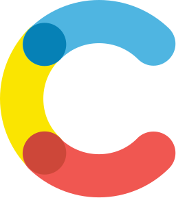

[](https://app.netlify.com/sites/mariaszubski/deploys)&nbsp;
&nbsp;


<!-- Badges generated by https://github.com/emazzotta/lighthouse-badges -->

&nbsp;
&nbsp;
&nbsp;
&nbsp;


# Freelance JavaScript Developer - Maria Szubski

**Portfolio hosted at https://mariaszubski.com**

Hi, I’m Maria and I work remotely as a **Freelance Front-End Developer** based
in Cincinnati, OH. I specialize in **Javascript**, **React**, **JAMStack**, and
**Shopify**. I love to help small businesses launch projects with the best
practices in accessibility, user experience, and maintainable code standards.

I've been a full-time contractor since 2018 and have worked with **7 clients**
on over **25 projects**. I’ve launched websites solo and have been embedded in
teams long-term. I pick up development languages and frameworks quickly and am
comfortable hopping on whatever tech stack best suits the client's needs.

Before freelancing, I spent 7 years as a **UX Designer** and **Developer** in
the consumer retail, entertainment, sports, and B2B software industries. I
volunteered with a tech non-profit for 3 years, organizing events and classes
for the local chapter. I've led in-person workshops on **GatsbyJS** and Intro to
Web Development.

### Interested in working together?

I'm always looking for new clients! Whether you have a specific project in mind
or your agency needs a part-time developer to handle project overflow, I’m happy
to hear from you. Reach out at **hello@mariaszubski.com** or through
**[LinkedIn](https://www.linkedin.com/in/mariaszubski/)** to get the ball
rolling.

## Portfolio Info

**Built with <a href="https://www.gatsbyjs.org">
 GatsbyJS </a>&nbsp;
<a href="https://www.contentful.com/">
 Contentful
</a>&nbsp; <a href="https://www.netlify.com/">
 Netlify </a>**


```bash
# install dependencies
$ yarn install

# run development server
$ gatsby develop -o

# build for production and launch local server
$ gatsby build && gatsby serve -o
```


[Connect on LinkedIn](https://www.linkedin.com/in/mariaszubski/)
